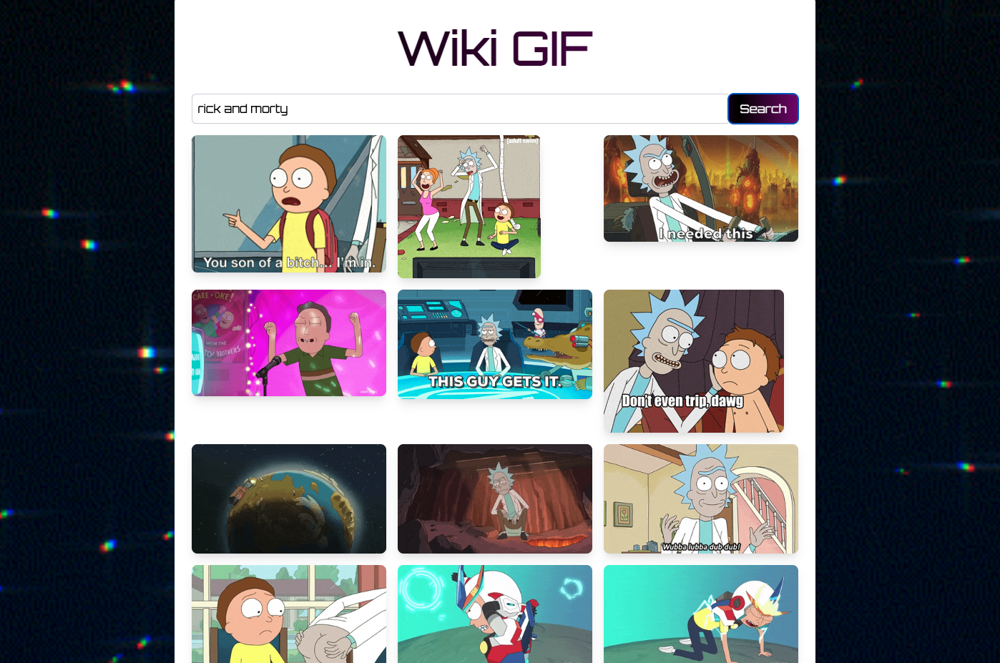

# Wiki GIF 👾

Wiki GIF is a simple gif finder application using the Giphy API, built with a lightweight frontend and an Express.js backend. It allows users to search for gifs and copy their URL to the clipboard with a single click. 

**Stack**:

- **Frontend**: HTML5, CSS3 (TailwindCSS), JavaScript (Vanilla).
- **Backend**: Node.js, Express.js, Axios (for Giphy API requests).
- **External Services**: Giphy API for GIFs.
- **Utilities**: dotenv for managing environment variables.

**Requirements**:
- Node.js (v14 or higher).
- Giphy API Key (obtain from [Giphy Developers](https://developers.giphy.com/)).

## Local setup ⚙️

1. Clone this repository:
    ```bash
    git clone https://github.com/fruetalo182/wiki-gif.git
    cd wiki-gif
    ```
2. Install dependencies:
    ```bash
    npm install
    ```
3. Create a `.env` file in the root directory with your Giphy API key:
    ```plaintext
    GIPHY_API_KEY=************
    ```
4. Start the server:
    ```bash
    npm start
    ```
5. Open your browser at [http://localhost:3000](http://localhost:3000) to use the app.

## Docker setup 🐳

To run the Wiki GIF application using Docker, follow these steps:

1. **Pull the Docker image**:

    ```bash
    docker pull fruetalo/wiki-gif:latest
    ```
    Or
    ```bash
    docker pull ghcr.io/fruetalo182/wiki-gif:latest
    ```

2. **Run the Docker container**:

    ```bash
    docker run -p 3000:3000 wiki-gif
    ```

3. **Access the application** at [http://localhost:3000](http://localhost:3000).

## Screenshots 📸



## Project final purpose 🔍
Utilize this app to test the following CI pipeline tools:
- Github Actions
- Jenkins
- CircleCI
- TravisCI

and multiple container Registry:
- Github Packages
- Docker Hub